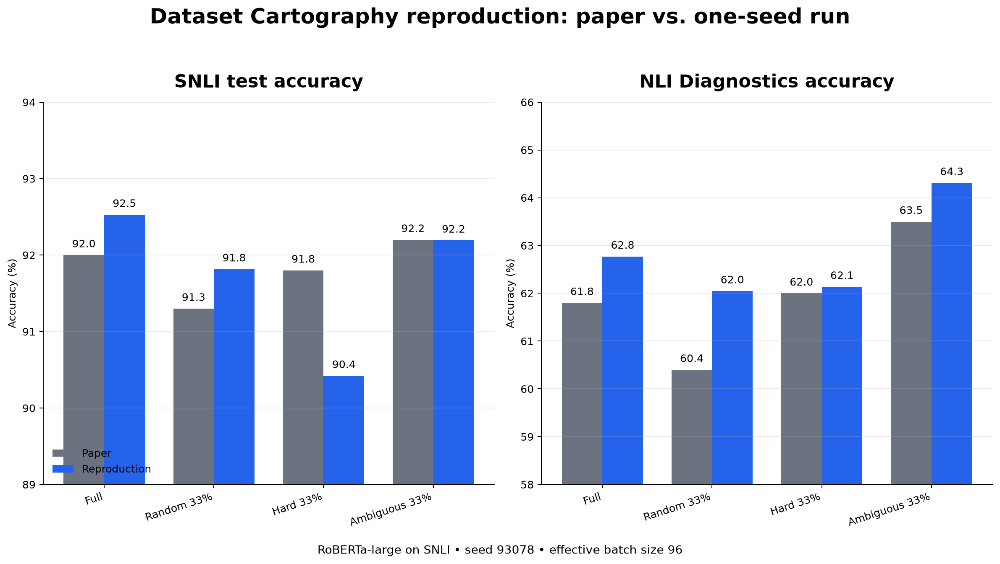

# Dataset Cartography: SNLI reproduction

This repository targets Table 3 of [Swayamdipta et al. (EMNLP 2020)](https://aclanthology.org/2020.emnlp-main.746/): SNLI test accuracy and NLI Diagnostics accuracy after fine-tuning `roberta-large` on full SNLI, a random 33% subset, or the authors' most ambiguous 33%. Hard-to-learn 33% is also supported. Published values are reference metadata, never experimental output. The first stage uses the [authors' released coordinates](https://github.com/allenai/cartography/tree/main/data/data_map_coordinates); a new map is a separate stage.

Designed for one NVIDIA RTX 4070 Ti SUPER with 16 GB VRAM and CUDA. Physical batch 32 with three accumulation steps reproduces effective batch 96. BF16 and dynamic padding keep the model within memory. See [recovered setup](docs/original_experiment.md) for exact settings, uncertainties, and deviations.

## Reproduction results

| Training data | Paper SNLI | Our SNLI | Paper Diagnostics | Our Diagnostics |
| --- | ---: | ---: | ---: | ---: |
| Full | 92.0 | **92.53** | 61.8 | **62.77** |
| Random 33% | 91.3 | **91.82** | 60.4 | **62.05** |
| Hard-to-learn 33% | 91.8 | **90.42** | 62.0 | **62.14** |
| Ambiguous 33% | 92.2 | **92.19** | 63.5 | **64.31** |

The main finding reproduces cleanly: the ambiguous third reaches **92.19%**, essentially the paper's 92.2%, and beats the equally sized random third. It is within 0.34 points of our full-data result while using roughly one third of the training examples.



See [the full results and limitations](docs/results.md), [machine-readable metrics](results/reproduction_metrics.csv), and [map comparison](results/map_comparison.json). The paper reports the best of three seeds; this reproduction is one run with seed 93078.

## Setup

```bash
uv sync --extra dev
uv run python scripts/prepare_snli.py
uv run python scripts/prepare_diagnostics.py
uv run python scripts/download_original_coordinates.py
uv run python scripts/build_subsets.py
uv run pytest -q
```

`prepare_snli.py` downloads official Stanford SNLI 1.0 and retains its original `pairID`s. It requires 549,367 valid train examples. The coordinate join must cover every one exactly once. Input data, checkpoints, and outputs stay under ignored `data/` and `outputs/` directories.

## Smoke test

```bash
uv run python scripts/train_snli.py --config configs/snli_full.yaml --smoke --max-train-examples 500 --max-steps 2 --output-dir outputs/smoke
```

The smoke test uses the full `roberta-large` model and trains for two optimizer steps; its accuracy is **not** a reproduction result. It logs peak GPU memory in `outputs/smoke/metrics.json`.

On the RTX 4070 Ti SUPER, the initial two-step smoke run completed with **6,864 MiB peak reserved VRAM** using BF16, physical batch 2, and accumulation 48. A subsequent 20-step benchmark with physical batch 32, accumulation 3, and dynamic padding reached about **346 examples/second** at **9,292 MiB peak reserved VRAM**. These checks establish model fit for the tested batches; they do not establish full-run accuracy.

## First full run

```bash
uv run python scripts/train_snli.py --config configs/snli_full.yaml
```

Resume from a checkpoint with `--resume-checkpoint outputs/checkpoints/full_seed93078/checkpoint-N`. The script records the physical and effective batch, learning rate, seed, epoch count, runtime, peak VRAM, validation accuracy, test accuracy, and OOD accuracy in `metrics.json`. Run the other conditions one at a time:

```bash
uv run python scripts/train_snli.py --config configs/snli_random33.yaml
uv run python scripts/train_snli.py --config configs/snli_ambiguous33.yaml
uv run python scripts/train_snli.py --config configs/snli_hard33.yaml
```

The paper reports the best of three seeds. The released config specifies seed 93078; the other reporting seeds are unknown. For additional seeds, copy a config and change `seed` and `output_dir`. Change the random subset seed with `build_subsets.py --seed N` before random runs. Do not combine results from different random manifests without recording their seeds.

## Unattended local run

`scripts/run_overnight_pipeline.sh` waits for the full-data systemd user service, validates its measured ID and OOD accuracies, then runs random 33%, ambiguous 33%, and hard-to-learn 33% sequentially. It generates the result tables and locally measured data map afterward. It refuses to start another condition when less than 10 minutes remain in its 18-hour budget, and each condition has a timeout at the remaining deadline. The queue writes `outputs/overnight_pipeline.log`; each condition also writes `outputs/checkpoints/<condition>/metrics.json`.

The queue requires the prepared data and project `.venv`. To survive logout, the account must have user-service lingering enabled (`loginctl show-user "$USER" -p Linger`). Monitor with `systemctl --user status dataset-cartography-queue.service --no-pager` and `tail -f outputs/overnight_pipeline.log`. A failed dependency or missing accuracy stops the queue rather than reporting a paper reference value as a result. Synthetic label-noise experiments are not queued.

## Evaluation and map reconstruction

```bash
uv run python scripts/evaluate_snli.py --checkpoint outputs/checkpoints/full_seed93078/final
uv run python scripts/evaluate_nli_diagnostics.py --checkpoint outputs/checkpoints/full_seed93078/final
uv run python scripts/paper_vs_reproduction.py
uv run python scripts/collect_training_dynamics.py --run outputs/checkpoints/full_seed93078
uv run python scripts/build_data_map.py
uv run python scripts/compare_maps.py
```

The full-data run records logits during its training forward pass. The completed local map covers 548,869 of 549,367 examples (99.91%). The collector removes repeated boundary examples and excludes IDs without one observation in every logged epoch; it fails below 99% coverage. It then computes population standard deviation and compares correlations and selected-ID overlap with the authors' map. Coverage and limitations are recorded in [the results report](docs/results.md).

## Presentation figures

Regenerate the committed, slide-ready figures from the compact results table:

```bash
uv run python scripts/make_presentation_figures.py
```

The most useful slides are [paper vs. reproduction](results/figures/accuracy_comparison.png), [the 33% selection comparison](results/figures/selection_comparison.png), and [our reconstructed data map](results/figures/snli_data_map.png). The first two are generated entirely from `results/reproduction_metrics.csv`; no checkpoint or dataset download is needed after environment setup.

## Files

`configs/` holds one YAML file per condition; `src/cartography_repro/` has data, selection, training, and evaluation functions; `scripts/` contains runnable commands; `docs/` records the recovered experiment and measured results; `tests/` holds small correctness checks. Compact results and presentation figures are committed under `results/`. Generated manifests, full logs, training dynamics, and checkpoints remain in ignored `data/` and `outputs/` directories.

The synthetic label-noise extension is deferred until the full/random/ambiguous numerical reproduction pipeline has completed, as specified by the experiment workflow. The deterministic corruption helper is included and tested, but noise training and detection claims are not part of current reproduction results.
